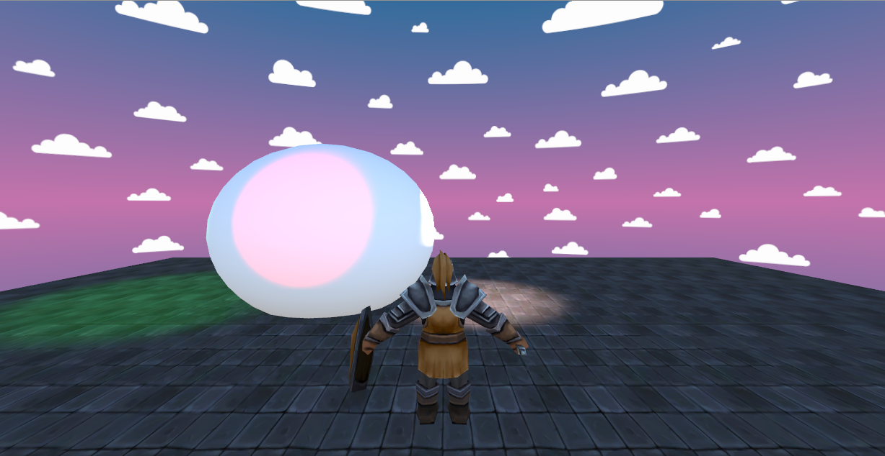

---
layout: post
title: "Game Development1 2nd assignment week9 AnimatingCharacter"
date: 2019-02-28
---

For this second assignment our group made a scene, containing an animated object, sounds, custom skybox and multiple sources of light.
    This assignment helped us develop or improve the knowledge regarding
•   Basic game object animation
•   Character animation
•   Shaders (which were one of the hardest things to comprehend)
•   Image effects
•   Textures
•   Custom skyboxes
•   Multiple lightning techniques
•   Particles 
•   Importing audio into the game

The group made this scene as an exercise to try and comprehend the new techniques presented to us in class, you just walk around on the plane surface try to observe the difference between certain way of lightning and how the particle system works (we tried to use snow particles for this).
 

In the picture above we can see a knight, that was our imported 3D asset from the unity asset store. We added sound effects to it when moving and/or attacking with his sword using the following scripts. Everything related to sounds was done by Mihai. He also did the snow particle system

Moving character:
the character has multiple animations, the Walk and Attack animation and Idle has been used, 
Each state has two-way transitions, and a script is controlling these animation states,
Below the animation states are diagram:
 

A script for movement and attack is added as follow:

using System.Collections;
using System.Collections.Generic;
using UnityEngine;
using UnityEngine.Experimental.UIElements;

public class knight_controller : MonoBehaviour
{
    float speed = 4;
    float rotSpeed = 80;
    private float rot = 0f;
    float gravity = 8;

    Vector3 movieDir = Vector3.zero;

    CharacterController controller;
    private Animator anim;

    // Use this for initialization
    void Start ()
    {
        controller = GetComponent<CharacterController>();
        anim = GetComponent<Animator>();
    }
	
	// Update is called once per frame
	void Update ()
    {
        Movement();
        GetInpuut();
    }

    void Movement()
    {
        if (controller.isGrounded)
        {
            if (Input.GetKey(KeyCode.W))
            {
                if (anim.GetBool("attacking") == true)
                {
                    return;
                }
                else if (anim.GetBool("attacking") == false)
                {
                    anim.SetBool("running", true);
                    anim.SetInteger("condition", 1);
                    movieDir = new Vector3(0, 0, 1);
                    movieDir *= speed;
                    movieDir = transform.TransformDirection(movieDir);
                }

            }
            if (Input.GetKeyUp(KeyCode.W))
            {
                anim.SetBool("running", false);
                anim.SetInteger("condition", 0);
                movieDir = new Vector3(0, 0, 0);
            }

        }

        rot += Input.GetAxis("Horizontal") * rotSpeed * Time.deltaTime;
        transform.eulerAngles = new Vector3(0, rot, 0);
        movieDir.y -= gravity * Time.deltaTime;
        controller.Move(movieDir * Time.deltaTime);
    }

    void GetInpuut()
    {
        if (controller.isGrounded)
        {
            if (Input.GetMouseButton(0))
            {
                if (anim.GetBool("running") == true)
                {
                    anim.SetBool("running", false);
                    anim.SetInteger("condition", 0);
                }
                if (anim.GetBool("running") == false)
                {
                    Attacking();
                }
                
            }
        }
    }

    void Running()
    {

    }
    
    void Attacking()
    {

        StartCoroutine(AttackRoutine());
        
    }

    IEnumerator AttackRoutine()
    {
        anim.SetBool("attacking", true);
        anim.SetInteger("condition", 2);
        yield return new WaitForSeconds(1);
        anim.SetInteger("condition", 0);
        anim.SetBool("attacking", false);
    }
}
